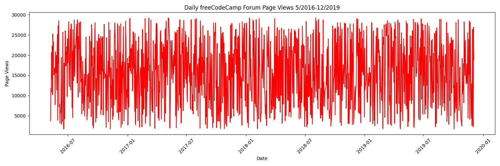
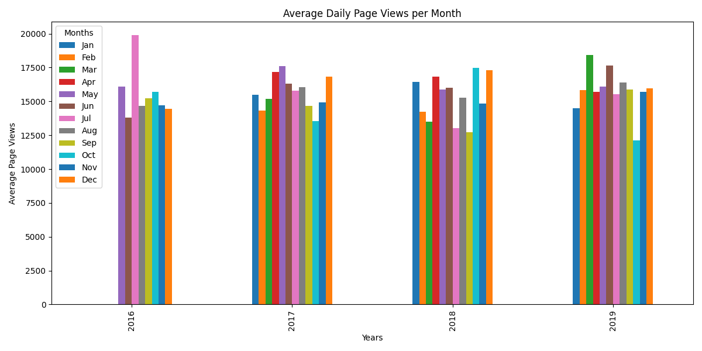

# Page View Time Series Visualizer

This project visualizes page view data over time using various types of plots. It is designed to help users understand trends and patterns in their page views through interactive visualizations.

## Project Structure

```
page-view-time-series-visualizer
├── images
│   ├── line_plot.png               # Line plot example
│   ├── bar_plot.png                # Bar plot example
│   └── box_plot.png                # Box plots example
├── src
│   ├── time_series_visualizer.py   # Contains functions for generating visualizations
│   ├── main.py                     # Entry point for the application
│   └── create_sample_csv.py        # Script to generate a sample CSV dataset
├── tests
│   └── test_module.py              # Unit tests for the visualization functions
├── fcc-forum-pageviews.csv         # Dataset used for visualizations
├── .gitignore                      # Specifies files to be ignored by Git
├── requirements.txt                # Lists project dependencies
└── README.md                       # Project overview and setup instructions
```

## Installation

1. Clone the repository:
   ```
   git clone <repository-url>
   cd page-view-time-series-visualizer
   ```

2. Create a virtual environment:
   ```
   python -m venv venv
   ```

3. Activate the virtual environment:
   - On Windows:
     ```
     venv\Scripts\activate
     ```
   - On macOS/Linux:
     ```
     source venv/bin/activate
     ```

4. Install the required packages:
   ```
   pip install -r requirements.txt
   ```

## Usage

To generate the visualizations, run the `main.py` file:
```
python src/main.py
```

This will load the dataset, clean the data, and generate the visualizations using the functions defined in `time_series_visualizer.py`.  
The resulting images will be saved in the `images/` directory.

## Example Visualizations

### Line Plot


### Bar Plot


### Box Plots


## Testing

To run the unit tests, execute the following command:
```
python -m unittest discover -s tests
```

This will ensure that all functions are working as expected.

## License

This project is licensed under the MIT License. See the LICENSE file for more details.